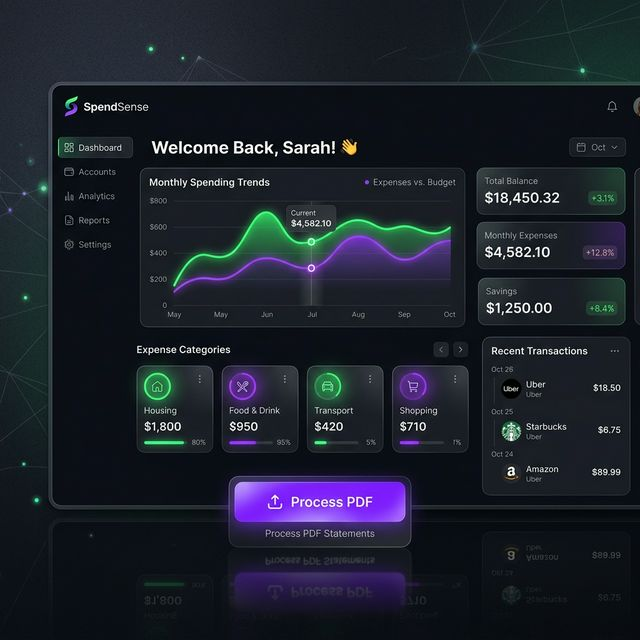

# 📊 SpendSense: AI Expense Analyzer - Pitch Deck

Welcome to the **SpendSense** presentation content! This guide provides a full, 8-slide structure designed to impress the judges. You can copy this structure into PowerPoint, Google Slides, or Canva.

---

## Slide 1: Title & Introduction

- **Title:** SpendSense
- **Tagline:** Financial Clarity Powered by AI
- **Presenter:** [Your Name / Team Name]
- **Elevator Pitch:** "We transform messy bank statements into beautiful, actionable financial insights in seconds using Artificial Intelligence."

---

## Slide 2: The Problem (The "Pain Point")

- **Manual Tracking is Exhausting:** People spend hours staring at obscure transaction names (e.g., `POS DEF 19842 *CASH`), having no idea where their money went.
- **Bank Statements are Locked Data:** Statements come in PDFs or messy Excel sheets that are difficult to parse and use.
- **Traditional Apps are Dumb:** Most budgeting apps rely on manual entry or simple keyword matching that constantly miscategorizes expenses.

---

## Slide 3: The Solution (SpendSense)

- **Magic Uploads:** Simply drag and drop your bank PDF or Excel file. SpendSense automatically extracts, cleans, and structures every transaction.
- **Intelligent Categorization:** Using Machine Learning, we understand the *context* of a transaction, auto-assigning categories with high confidence.
- **Instant Financial Clarity:** Beautiful, real-time charts show exactly where your money is going, identifying hidden spending habits instantly.

---

## Slide 4: Key Features that Wow
- 🧠 **Smart AI Engine:** Bypasses hard-coded rules and learns from transaction descriptions to accurately guess categories.
- 📄 **Universal Document Support:** Seamlessly reads unformatted CSVs, messy Excel files, and full Bank Statement PDFs (built-in OCR & Table Extraction).
- 📈 **Dynamic Analytics Dashboard:** Dark-mode optimized, interactive visual charts showing daily trends and category breakdowns.
- 🔒 **Privacy-First:** Secure JWT authentication, hashed passwords, and local database storage ensure user data never leaks.

---

## Slide 5: The Tech Stack (Under the Hood)

- **Frontend:** Next.js, React, Tailwind CSS (for a sleek, modern, buttery-smooth UI).
- **Backend:** FastAPI (Python) mapping high-speed API routes and complex data parsing in milliseconds.
- **Machine Learning & Data:** Pandas, Scikit-Learn (Predictive Categorization), PDFPlumber (Document Parsing).
- **Database:** PostgreSQL for robust, scalable, and relational data architecture.

---

## Slide 6: Target Market
- **The Everyday Consumer:** Young professionals trying to save for a house and manage lifestyle creep.
- **Freelancers & Gig Workers:** Need to quickly organize expenses for tax write-offs without hiring an accountant.
- **Small Business Owners:** Want an immediate, high-level overview of operational expenditures from multiple bank accounts.

---

## Slide 7: Why We Win (Competitive Advantage)
- **Frictionless Onboarding:** No need to link live bank accounts via expensive APIs (like Plaid) right away. Just upload the PDF you already have.
- **Premium User Experience:** A beautiful, responsive design that users *want* to interact with, avoiding the boring, clinical look of traditional banking tools.
- **Accuracy:** Our AI understands that "Amazon Web Services" is Software/Tech, while "Amazon Fresh" is Groceries.

---

## Slide 8: Future Roadmap & Q&A
- **Q3:** Real-time Bank Syncing (Plaid Integration).
- **Q4:** **Chatot Assistant** — A conversational AI where you can ask, *"How much did I spend on coffee this month?"* and get instant answers.
- **Next Year:** Cross-platform Mobile App.
- **Thank You!** 
- *Questions from the judges?*
